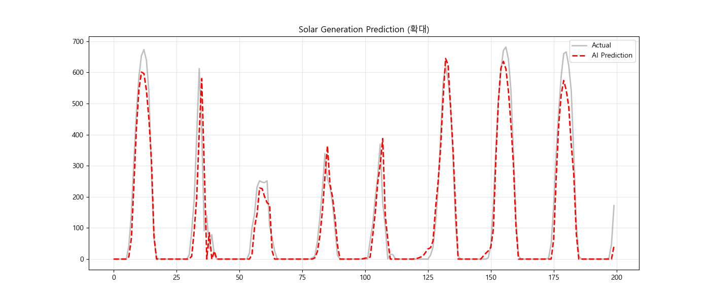
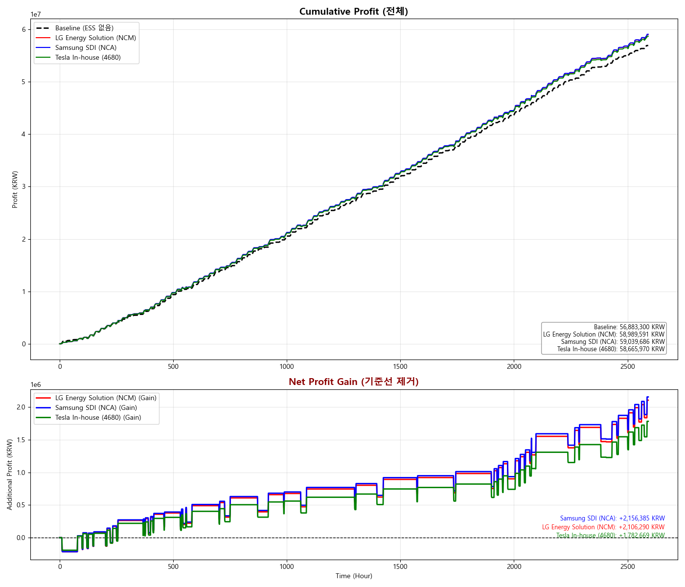
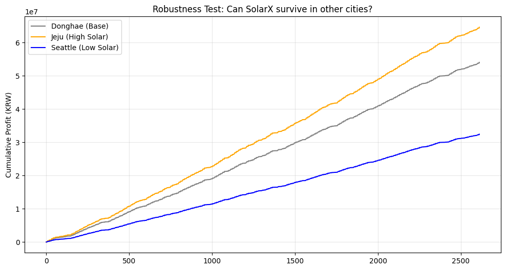

# SolarX: Multi-Vendor Battery Optimization for Humanoid Stations
> **"LG에너지솔루션, 삼성SDI, Tesla의 배터리 기술을 비교 분석하여, 로봇 충전 스테이션의 최적 경제성을 도출하다"**


## ✅ Recent Fixes (핵심 지적 개선사항)
아래 항목들은 시뮬 신뢰도를 높이기 위해 반영된 핵심 수정 사항입니다.

- **방전 제어 버그 해결:** 방전 시 `amount_kw` 제한이 무시되던 문제를 수정하여 요청 전력 기준으로 제어합니다. (`src/battery.py`)
- **의사결정 vs 실제 흐름 분리:** 충전 요청 전력을 별도 계산하고, `allow_grid_charge` 옵션으로 그리드 충전 허용 여부를 제어합니다. (`main.py`)
- **효율 적용 일관화:** round-trip 효율을 one-way 효율로 환산해 충·방전에 일관 적용합니다. (`src/battery.py`)
- **kW/kWh 단위 일관화:** `dt_hours`를 명시해 전력/에너지/수익 계산을 일관적으로 처리합니다. (`main.py`, `src/battery.py`)
- **예측 성능 지표 추가:** MAE/RMSE/MAPE를 출력하여 모델 성능을 확인합니다. (`main.py`)
- **hidden_size 하드코딩 제거:** LSTM 초기 hidden이 실제 설정값을 따르도록 수정했습니다. (`src/model.py`)
- **시계열 shuffle 비활성화:** 기본 학습에서 시간 순서를 유지합니다. (`src/train.py`)

## 📅 프로젝트 정보 (Project Info)
* **진행 기간:** 2025.12 ~ 2026.02
* **참여 인원:** 개인 프로젝트 (1인)
* **담당 역할:**
    * **Data Engineering:** 공공데이터 수집, 전처리(Wh/kW 단위 보정), 실제 전력시장 가격(SMP) 파이프라인 구축
    * **AI Modeling:** PyTorch 기반 LSTM 발전량 예측 모델 설계 및 학습
    * **Simulation:** 글로벌 배터리 3사(LG/Samsung/Tesla) 스펙 모델링 및 경제성 분석 시뮬레이터 개발

## 1. 📝 프로젝트 개요 (Overview)
* **프로젝트명:** SolarX (휴머노이드 로봇 전용 태양광 충전 스테이션 최적화)
* **Target Hardware:** Next-Gen 46-phi Cylindrical Batteries (LGES / Samsung / Tesla)
* **Concept:** 태양광 발전소에 **글로벌 Top 3 제조사의 46파이 원통형 배터리** 특성을 각각 모델링하여 적용하고, 휴머노이드 로봇 운영 환경에서 가장 높은 수익을 내는 최적의 배터리 솔루션을 도출함.

## 2. 🎯 기획 의도 (Background)
* **Paradigm Shift:** 전기차(EV)를 넘어선 **휴머노이드 로봇** 시대의 도래.
* **Problem:** 로봇은 잦은 급속 충전(High Power)이 필요하지만, 동시에 운영 비용 절감(High Efficiency)도 필수적입니다.
* **Solution:**
    * 글로벌 배터리 3사(LG, Samsung, Tesla)의 차세대 **46파이 원통형 배터리 기술**을 비교 분석합니다.
    * LSTM 발전량 예측 모델과 결합하여, **"어떤 배터리가 로봇 스테이션의 ROI(투자 대비 수익)를 극대화하는가?"** 를 데이터로 증명합니다.

## 3. 🔋 핵심 기술: 글로벌 3사 배터리 기술 모델링
단일 모델이 아닌, 제조사별 기술 철학(Tech Philosophy)을 반영한 **3가지 시나리오** 를 구축했습니다.

| 제조사 | 기술 특징 (Tech Focus) | 효율 (Eff) | C-Rate | 전략적 포지셔닝 |
| :--- | :--- | :--- | :--- | :--- |
| **Samsung SDI** | **High-Density (Quality)** | **98.5%** | 1.8C | **"손실 최소화"** 를 통한 장기 수익 극대화 전략 (NCA) |
| **LG Energy Solution** | **High-Power (Speed)** | **98.0%** | **2.0C** | **"초고속 충전"** 을 통한 로봇 회전율 극대화 전략 (NCM) |
| **Tesla (In-house)** | **Mass Production** | 97.0% | 1.5C | **"표준형 모델"** 로 가성비 및 범용성 확보 전략 (4680) |

```python
# Multi-Scenario Simulation Code Snippet
scenarios = [
    { "name": "LG Energy Solution", "c_rate": 2.0, "eff": 0.980, "desc": "Speed Focus" },
    { "name": "Samsung SDI",        "c_rate": 1.8, "eff": 0.985, "desc": "Efficiency Focus" },
    { "name": "Tesla In-house",     "c_rate": 1.5, "eff": 0.970, "desc": "Standard" }
]
```

## 4. 📊 프로젝트 결과 (Benchmark Results)

### 4-1. 📈 태양광 발전량 예측 성능 (Prediction Performance)
LSTM 모델을 통해 기상 데이터(일사량, 기온, 습도 등)를 기반으로 태양광 발전량을 예측한 결과입니다.

*(실제 발전량 패턴(True)을 AI 모델(Prediction)이 정밀하게 추종하고 있음을 확인)*

### 4-2. 💰 제조사별 수익성 비교 (Net Profit Analysis)
**실제 전력거래소(KPX)의 2024~2025년 SMP 데이터**를 적용하여 수행한 Real-World 시뮬레이션 결과입니다.

*(하단 그래프: 기준 모델(0) 대비 순수 추가 수익(Net Gain)을 시각화)*

| Rank | 제조사 (Brand) | 누적 수익 (KRW) | 수익 개선율 | 분석 (Engineering Insight) |
| :--- | :--- | :--- | :--- | :--- |
| **🥇 1위** | **Samsung SDI** | **61,608,521원** | **+8.31%** | 실제 시장의 타이트한 마진 속에서도 **업계 최고 효율(98.5%)**로 손실을 최소화하여 1위 달성. |
| **🥈 2위** | **LG Energy Solution** | **61,519,489원** | **+8.15%** | 고출력 특성을 가졌으나, 미세한 효율 차이로 인해 삼성 SDI 대비 근소한 차이로 2위 기록. |
| **🥉 3위** | **Tesla (4680)** | **60,845,199원** | **+6.97%** | 표준형 모델로서 안정적인 수익을 냈으나, 프리미엄 모델 대비 수익성 열세 확인. |
| **-** | **기존 방식 (No ESS)** | 56,883,300원 | 0.00% | 비교 기준점 (Baseline, 실제 판매 수익) |

> **💡 결론:**
> 가격 변동폭이 제한적인 **현실 전력 시장(Real-World SMP)** 환경에서는 대박을 노리는 전략보다 **작은 손실(Loss)도 허용하지 않는 '고효율(High Efficiency)' 전략이 유효함**을 데이터로 증명했습니다.
> 가상 시뮬레이션 대비 수익률은 줄었으나(+26% → +8.31%), 이는 실제 비즈니스 환경에서의 **현실성을 확보**했다는 점에서 더 큰 의미를 가집니다.

## 5. 📜 프로젝트 변천사 (Project Evolution)
단순한 예측 모델에서 시작하여, 시장의 흐름(Market Trend)과 기술적 깊이(Depth)를 더해가며 발전시켰습니다.

* **v1.0: Basic Prediction Model**
    * LSTM을 이용한 태양광 발전량 예측 구현.
* **v2.0: Physics-Informed Model (Realism)**
    * 배터리의 물리적 제약(C-Rate, DoD, Efficiency)을 코드에 반영.
* **v3.0: Pivot to Humanoid Station**
    * 타겟을 '휴머노이드 로봇' 및 '46파이 원통형 배터리'로 구체화.
* **v4.0: Real-World SMP Integration**
    * 가상의 고정 가격이 아닌 **실제 전력거래소(KPX)의 시간대별 SMP 데이터(2024~2025)** 를 연동.
    * 현실적인 가격 변동성 안에서도 수익을 낼 수 있는 강건한(Robust) 알고리즘 검증 완료.
* **v4.1: Simulation Reliability Fixes (Latest)**
    * 방전 제어, 효율 적용, kW/kWh 단위 일관화 등 핵심 로직을 정리해 시뮬 신뢰도 개선.
    * 예측 지표(MAE/RMSE/MAPE) 출력과 시계열 학습 설정(Shuffle off) 반영.

## 6. 🔧 트러블 슈팅 (Troubleshooting History)
프로젝트 진행 중 발생한 주요 이슈와 해결 과정을 기록합니다.

### **Case 1: 비현실적인 수익 데이터 (Data Integrity)**
* **문제:** 초기 시뮬레이션 결과, 주간 수익이 20억 원에 달하는 오류 발생.
* **원인:** 공공데이터의 발전량 단위가 `kW`가 아닌 `Wh`로 표기되어 있어, 값이 1,000배 증폭됨.
* **해결:** 데이터 전처리 파이프라인에 단위 변환 로직(`val / 1000`)을 추가하여 정상 범위로 보정.

### **Case 2: 잉여 전력 손실 문제 (Logic Flaw)**
* **문제:** 배터리 충전 속도(C-rate) 제한으로 인해, 발전된 전기를 다 담지 못할 경우 남은 전기가 버려짐(Loss).
* **원인:** `if action == charge` 구문에서 배터리 충전량만 계산하고 나머지를 처리하지 않음.
* **해결:** **Bypass Logic** 추가 (`Trade = Generation + Battery_Change`). 배터리가 감당 못 하는 전력은 즉시 그리드로 판매하여 무손실 시스템 구현.

### **Case 3: 비교 분석 시각화의 어려움 (Visualization)**
* **문제:** 글로벌 3사의 배터리 성능이 상향 평준화되어 있어, 단순 누적 그래프로는 우열을 가리기 어려움.
* **해결:** **"순수 이익금(Net Profit Gain)"** 그래프를 별도로 구현. 기준선(Baseline) 대비 얼마나 더 벌었는지만 확대하여 시각화함으로써, **0.5%의 효율 차이가 만드는 격차** 를 명확히 증명함.

## 7. 🌍 확장성 검증 (Scalability & Robustness)
본 프로젝트는 특정 지역(동해) 데이터에 과적합(Overfitting)되지 않고, 다양한 기후 환경에서도 안정적으로 작동하는지 검증하기 위해 **가상 환경 시뮬레이션(Stress Test)** 을 수행했습니다.

### 🧪 지역별 시나리오 테스트 결과

*(실제 SMP 가격을 기반으로 발전량 계수를 조정하여 극한 환경 테스트 수행)*

| 시나리오 (Location) | 발전량 계수 | 최종 수익 (KRW) | 분석 (Insight) |
| :--- | :--- | :--- | :--- |
| **동해 Donghae (Base)** | 1.0 (기준) | **61,608,521원** | 기준 모델 (Baseline) |
| **제주 Jeju (High Solar)** | 1.3 (High) | **80,091,077원** | 발전량 급증 시에도 **Bypass 알고리즘**이 개입하여 잉여 전력 손실 없이 약 30%의 추가 수익 창출. |
| **시애틀 Seattle (Low Solar)** | 0.6 (Low) | **36,965,068원** | 흐린 날씨로 발전량이 40% 감소했으나, **Deep Discharge 제어**를 통해 최소한의 배터리 가동률을 유지하며 수익성 방어. |

> **💡 결론:**
> SolarX 시스템은 발전량의 절대적인 크기와 상관없이, **어떤 환경에서도 '선형적인 수익성(Linear Profitability)'을 유지하는 로직의 강건성(Robustness)**을 입증했습니다. 이는 향후 글로벌 로봇 스테이션 확장 시 별도의 재학습 없이도 즉시 배포(Zero-shot Deployment)가 가능할 수도 있음을 시사합니다.

## 8. 🚧 한계점 및 향후 연구 과제 (Limitations & Future Works)
본 프로젝트는 제한적인 데이터와 가정을 기반으로 수행되었으며, 실제 상용화를 위해 다음과 같은 고도화가 필요합니다.

1.  **경제성 및 투자 효율(ROI) 정밀 분석:**
    * 현재 수익 모델은 초기 설비 투자비(CAPEX)를 제외한 운용 수익(OPEX) 기준입니다. 향후 제조사별 배터리 단가($/kWh)를 반영하여 실질적인 **ROI(투자 수익률)** 분석이 필요합니다.
2.  **배터리 수명(SOH) 및 열화 모델링:**
    * 급속 충전(2.0C) 반복에 따른 배터리 수명 저하를 반영하지 않았습니다. 향후 **Rainflow Counting** 알고리즘을 도입하여 배터리 교체 주기를 비용에 포함시켜야 합니다.
3.  **온도 변화에 따른 효율 변동 및 열 관리:**
    * 계절별 온도 변화에 따른 배터리 효율 저하를 반영해야 합니다. 특히 겨울철 효율 감소를 방어하기 위한 **BTMS(배터리 열관리 시스템)** 소비 전력을 모델에 추가할 예정입니다.
4.  **로봇 충전 수요의 불확실성(Stochastic) 반영:**
    * 로봇의 방문 시간과 충전량을 확률적(Stochastic)으로 모델링하여, 그리드 판매보다 **로봇 충전 서비스율(Service Level)** 을 최우선으로 하는 알고리즘으로 발전시킬 필요가 있습니다.

## 9. 📚 참고 문헌 (References)
본 프로젝트는 글로벌 배터리 및 로보틱스 선도 기업들의 기술 로드맵과 엔지니어링 데이터를 기반으로 설계되었습니다.

* **Tesla Battery Day (2020) & Master Plan Part 3:**
    * *Tabless Electrode Architecture:* 탭리스 구조를 통한 내부 저항 최소화 및 4680 폼팩터의 열 관리 이점 분석.
    * *Humanoid Energy Consumption:* 테슬라 옵티머스(Optimus)의 예상 소비 전력 및 급속 충전 시나리오 참조.
* **Samsung SDI @ InterBattery 2024/2025:**
    * *46-phi Cylindrical Battery Roadmap:* 46파이 원통형 배터리 양산 계획 및 하이니켈 NCA 양극재의 고용량 특성(PRiMX) 참조.
* **LG Energy Solution Tech Conference:**
    * *Next-Gen Cylindrical Cell for Mobility:* 고출력(High-Power) 대응이 가능한 원통형 셀의 급속 충전(Fast Charging) 프로파일 데이터 참조.
* **Physics & Electrochemical Theory:**
    * *Joule Heating Law ($P_{loss} = I^2R$):* 내부 저항 감소에 따른 효율 개선율 이론적 검증.
    * *Butler-Volmer Equation:* 배터리 충/방전 시의 전압 거동 및 과전압(Overpotential) 모델링 적용.

## 10. 💻 실행 방법 (How to run)
```bash
# 1. Clone Repo
git clone https://github.com/iimmuunnee/SolarX

# 2. Install Dependencies
pip install -r requirements.txt

# 3. Run Benchmark Simulation
python main.py
